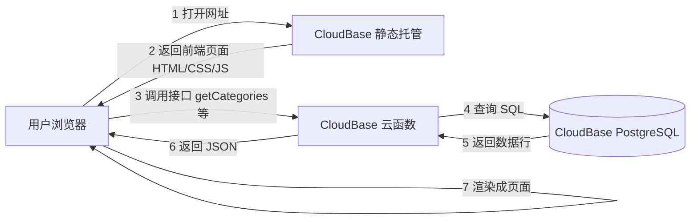

# TECH_DESIGN.md — 「知蕴」技术设计

> 项目：知蕴（中华传统文化学习平台）
> 日期：Day 5
> 依据：`PRD.md`（Day 4 产品需求文档）
> 说明：本文档只做技术设计，**不写代码**。所有代码实现留到开发阶段。

---

## 0. 技术路线（一句话版）

**技术路线**：前端 **React + Vite** ｜ 后端 **CloudBase Node.js 云函数** ｜ 数据库 **CloudBase PostgreSQL** ｜ 部署 **CloudBase 静态网站托管**

### 为什么选它（取舍理由）

| 理由 | 说明 |
|------|------|
| 对齐既定方向 | PRD/研究阶段的路线就是这套，自洽 |
| 免运维 | 不用买服务器、装数据库、配 Nginx，运维交给云 |
| 国内访问快 | 目标用户含大量中文使用者，国内节点更快 |
| 与训练营示范一致 | 出问题能对得上教程，好求助 |

### 淘汰的方案

- **纯前端静态站**：没有后端与数据库，无法承载 PRD 定义的动态逻辑，且放弃既定路线。
- **自建云服务器（Express + MySQL + Nginx）**：能力最强，但把服务器运维复杂度交给零基础作者，24 天内风险最高。

> 说明：本设计采用"**示范路线**"，不做多方案并行验证；若后续发现不适配，按第 10 节「未来演进」逐步替换。

---

## 1. 项目结构

> 现状：仓库当前只有文档（`AGENTS.md` / `research.md` / `PRD.md` / `TECH_DESIGN.md`）和 Day 2 的占位页 `index.html`。
> 目标结构如下，**开发阶段（Day 5 之后）逐步落地**；届时根目录的占位 `index.html` 由 `frontend/index.html` 取代。

```
vibe-coding-lab/
├── AGENTS.md                 # 项目规则（Day 1）
├── research.md               # 需求研究（Day 3）
├── PRD.md                    # 产品需求文档（Day 4）
├── TECH_DESIGN.md            # 本文档（Day 5）
├── .gitignore                # 忽略清单（含 .env）
├── index.html                # Day 2 占位页（后续由 frontend/ 取代）
│
├── frontend/                 # 前端工程（React + Vite）
│   ├── package.json
│   ├── vite.config.js
│   ├── index.html
│   ├── public/               # 静态资源
│   └── src/
│       ├── main.jsx
│       ├── App.jsx           # 路由与全局布局
│       ├── pages/
│       │   ├── Home.jsx           # 首页：欢迎词 + 滚动滑出九大类
│       │   ├── Category.jsx       # 九大类目页：描述 + 细分项
│       │   ├── Detail.jsx         # 小类页：节日十项内容
│       │   └── ComingSoon.jsx     # 「内容建设中」占位页
│       ├── components/
│       │   ├── LangSwitch.jsx     # 中 / EN 切换按钮
│       │   ├── CategoryCard.jsx   # 九大类卡片
│       │   └── Loading.jsx        # 加载 / 失败 / 空状态
│       ├── i18n/                  # 中英文界面文案
│       └── api/                   # 调用云函数接口的封装
│
├── cloudfunctions/           # 后端（CloudBase 云函数）
│   ├── getCategories/        # 取九大类列表
│   ├── getCategoryDetail/    # 取某大类描述 + 细分项
│   └── getFestivalDetail/    # 取某节日十项内容
│
├── db/                       # 数据库
│   ├── schema.sql            # 建表语句（见第 2 节数据模型）
│   ├── migrations/           # 结构变更迁移脚本（按日期命名）
│   └── seed/                 # 初始化内容数据（脚本 + 数据文件）
│
└── .env.example              # 环境变量样例（真实 .env 不入库）
```

---

## 2. 数据模型（PostgreSQL）

四张表。设计原则：**中英并列字段（双列存储）**、**内容与结构分离**、**便于后续扩展**。

### 2.1 `categories` — 九大类

| 字段 | 类型 | 说明 |
|------|------|------|
| id | serial PK | 主键 |
| slug | varchar UNIQUE | 英文标识，如 `festivals` |
| name_zh / name_en | varchar | 类别名称（中 / 英） |
| description_zh / description_en | text | 该类**形式与意义**的描述（中 / 英） |
| cover_image_url | text | 卡片代表图 URL |
| sort_order | int | 展示顺序 |
| created_at / updated_at | timestamptz | 时间戳 |

### 2.2 `subitems` — 细分项

| 字段 | 类型 | 说明 |
|------|------|------|
| id | serial PK | 主键 |
| category_id | int FK → categories.id | 所属大类 |
| slug | varchar UNIQUE | 如 `mid-autumn` |
| name_zh / name_en | varchar | 细分项名称（中 / 英） |
| has_content | boolean | **是否有详情内容**；`false` → 前端进「内容建设中」占位页 |
| sort_order | int | 展示顺序 |
| created_at / updated_at | timestamptz | 时间戳 |

### 2.3 `content_sections` — 内容板块（节日的文字内容）

> 用"板块表"而非"宽表"，好处：**将来增删内容板块不用改表结构**，只加/删数据行。

| 字段 | 类型 | 说明 |
|------|------|------|
| id | serial PK | 主键 |
| subitem_id | int FK → subitems.id | 所属细分项 |
| section_key | varchar | 板块标识：`origin` / `story` / `spirit` / `customs` / `poems` / `past_now` / `trivia` / `ich` / `overseas` |
| title_zh / title_en | varchar | 板块标题（中 / 英） |
| body_zh / body_en | text | 板块正文（中 / 英） |
| sort_order | int | 展示顺序 |

**section_key 对照（对应 PRD 的 10 项内容）**

| section_key | 对应 PRD 内容 |
|-------------|--------------|
| origin | 由来 |
| story | 对应的故事 |
| spirit | 蕴含的精神与文化符号 |
| customs | 各地传统习俗 + 美食器物 |
| poems | 经典诗词赏析 |
| past_now | 古今过节对比 |
| trivia | 趣味冷知识 & 常见误区 |
| ich | 相关非遗 |
| overseas | 海外华人如何过节 |

> PRD 第 4 项"对应主题的照片"独立成表（见 2.4）。

### 2.4 `festival_photos` — 节日主题照片

| 字段 | 类型 | 说明 |
|------|------|------|
| id | serial PK | 主键 |
| subitem_id | int FK → subitems.id | 所属细分项 |
| image_url | text | 图片地址（存 **CloudBase 云存储** 的 URL，不存图片本体） |
| caption_zh / caption_en | varchar | 图注（中 / 英） |
| sort_order | int | 展示顺序 |

### 2.5 表关系

```
categories (1) ──< (N) subitems (1) ──< (N) content_sections
                              │
                              └──< (N) festival_photos
```

---

## 3. API 列表（云函数接口）

> 本期**无用户系统**，所有接口**只读、公开、不加鉴权**。
> **语言策略**：接口**同时返回中英双字段**，前端本地切换、切换时不重新请求（响应体积略大，换取切换体验）。

| # | 接口（云函数） | 入参 | 返回 | 对应 PRD |
|---|--------------|------|------|---------|
| 1 | `getCategories` | 无 | 九大类列表（slug、名称中英、描述中英、封面图） | 首页 + 类目页 |
| 2 | `getCategoryDetail` | `slug` | 某大类描述中英 + 细分项列表（含 `has_content`） | 九大类目页 |
| 3 | `getFestivalDetail` | `slug` | 某节日的九类内容板块中英 + 照片列表 | 小类页 |

**不做的接口**（本期）：搜索、登录、写入/编辑内容（无后台，见第 10 节）。

---

## 4. 数据流图

### 4.1 Mermaid 版（GitHub 上可直接渲染成图）



### 4.2 纯文本版（本地打开也能看）

```
[用户浏览器]
     │  ① 打开网址
     ▼
[CloudBase 静态托管]  ── ② 返回前端页面(HTML/CSS/JS) ──▶ [用户浏览器]
     ▲
     │ ③ 前端调用接口（getCategories / getCategoryDetail / getFestivalDetail）
     ▼
[CloudBase 云函数] ── ④ 查询 SQL ──▶ [CloudBase PostgreSQL]
                                             │
        ⑥ 返回 JSON ◀── ⑤ 返回数据行 ◀──────┘
     │
     ▼
[用户浏览器] ── ⑦ 渲染成页面展示给用户
```

### 4.3 一句话说清"数据从哪来、到哪去"

> **内容数据从 PostgreSQL 数据库来，经云函数接口取出，送到前端页面渲染展示给用户。**
> 本期无用户系统，是**单向只读流**；图片等静态资源从 CloudBase 云存储加载。将来加入"写内容"功能后，才会出现"用户 → 前端 → 云函数 → 数据库"的**反向流**。

---

## 5. 错误处理

### 5.1 统一响应格式

```json
{ "code": 0, "message": "ok", "data": { } }
```

| code | 含义 | 触发场景 |
|------|------|---------|
| 0 | 成功 | 正常返回 |
| 400 | 参数错误 | 缺少 `slug` 等必填参数 |
| 404 | 内容不存在 | `slug` 在数据库中查不到 |
| 2001 | 内容建设中 | `subitems.has_content = false`（前端跳占位页，属**正常**业务态，不是错误） |
| 500 | 服务器错误 | 数据库连接失败、SQL 异常等 |

### 5.2 各层处理原则

- **云函数**：统一 `try/catch`；出错**记录日志**（含入参、错误栈），但**只向用户返回友好提示**，不泄露内部细节（如 SQL 语句、连接串）。
- **前端**：每个数据请求都有三态 UI——**加载中 / 加载失败（可重试）/ 空状态**；失败时给"重试"按钮，不白屏。
- **占位页**：`has_content = false` 时进入「内容建设中」页（含"返回上一页"），**这是设计内的流程，不是报错**。

---

## 6. 环境变量

| 变量名 | 用途 | 存放位置 | 是否入库 |
|--------|------|---------|---------|
| `TCB_ENV_ID` | CloudBase 环境 ID | CloudBase 环境配置 / 本地 `.env` | ❌ 不入库 |
| `PG_CONNECTION_STRING` | PostgreSQL 连接串（含用户名密码） | CloudBase 环境配置 / 本地 `.env` | ❌ 不入库 |
| `SEED_DATA_PATH` | 初始化内容数据文件路径 | 云函数配置 | 可选 |

**规范（呼应 AGENTS.md 第 5 条）**：

- 真实 `.env` **永不入库**（`.gitignore` 已含 `.env`、`.env.*`）。
- 仓库中只保留 **`.env.example`**（样例，占位值，无真实密钥）。
- 环境变量在 **CloudBase 控制台**为云函数配置，不写进代码。

---

## 7. 部署与迁移注意事项

### 7.1 部署流程（开发阶段执行）

1. **数据库**：先跑 `db/schema.sql` 建表 → 再跑 `db/seed/` 导入九大类与 8 个节日内容。
2. **云函数**：部署 3 个云函数，并在控制台配置第 6 节的环境变量。
3. **前端**：`npm run build` 生成产物 → 上传到 CloudBase 静态网站托管。
4. **验收**：按 `PRD.md` 第 5 节 A–G 逐条自测。

### 7.2 注意事项

- ⚠️ **环境变量优先于代码**：数据库连接串只存在于环境变量中；部署前先确认已配置，否则云函数会连不上库。
- ⚠️ **数据库结构变更必须写迁移脚本**：放进 `db/migrations/`（按日期命名），不要手工改线上库，保证本地/线上结构一致。
- ⚠️ **图片走云存储**：图片上传到 CloudBase 云存储，数据库只存 URL；换图=换 URL，不动表结构。
- ⚠️ **占位页逻辑依赖 `has_content`**：新增内容后记得把该字段改为 `true`，否则用户仍看到"建设中"。
- ⚠️ **默认域名**：本期用 CloudBase 默认域名（不备案）；将来绑自有域名需先完成备案。

---

## 8. 已确认的设计假设（Day 5 与作者确认）

| # | 假设 | 说明 |
|---|------|------|
| 1 | **不做内容管理后台**（选 A 方案） | 内容用 `db/seed/` 脚本导入；改内容=改文件+重跑导入 |
| 2 | **中英双列存储** | 数据库存两列，页面靠「中/EN」切换**只显示一种**（非页面双列） |
| 3 | 图片存 **CloudBase 云存储** | 数据库只存图片 URL |
| 4 | API **只读、公开、无鉴权** | 本期无用户系统 |
| 5 | 用 **CloudBase 默认域名** | 不绑自有域名、不备案 |
| 6 | CloudBase 环境**尚未开通** | 文档中 envId 用占位符，开发时回填 |
| 7 | 数据流图粒度 | 到"浏览器 → 静态托管 → 云函数 → 数据库"这一层 |

---

## 9. 术语速查

| 术语 | 大白话 |
|------|--------|
| 技术栈 | 项目用到的一整套技术工具（前端 + 后端 + 数据库 + 部署） |
| API / 接口 | 前端向后端"要数据"的通道 |
| 鉴权 | 验证"你是谁、有没有权限" |
| 云函数 | 跑在云上的小段后端程序，按需执行、免运维 |
| 对象存储 / 云存储 | 专门存文件（图片等）的服务，像云盘 |
| CDN | 内容分发网络，让静态资源加载更快 |
| 环境变量 | 存配置与密钥的地方，不进代码 |
| 迁移（migration） | 数据库结构变更的脚本化记录，保证结构一致 |
| 部署 | 把做好的东西发到网上，让别人能访问 |

---

## 10. 未来演进：扩大规模 / 加功能时怎么改

> 设计都留了后路，但改动代价不同（🟢 低 / 🟡 中 / 🔴 高）。

| 想加的功能 | 怎么改 | 代价 |
|-----------|--------|------|
| **内容管理后台** | 新增 `admin/` 模块 + 登录鉴权 + 写入类云函数（新增接口，不动只读接口） | 🟡 中 |
| **第三种语言（如日文）** | `categories / subitems / content_sections / festival_photos` 各**新增 `*_ja` 列** + 数据迁移 + 前端语言项 | 🟡 中 |
| **改为 JSON 单字段存多语言** | 需数据迁移 + 改所有查询语句 | 🔴 高（**所以现在选双列要谨慎**，当前规模合适） |
| **加全文搜索** | 引入搜索方案（如 PostgreSQL 全文检索或独立搜索服务）+ 新接口 | 🟡 中 |
| **加用户系统（收藏/笔记）** | 新增 `users`、`favorites` 等表 + 登录鉴权 + 写接口 | 🟡 中 |
| **图床换服务** | 改上传逻辑与 URL 配置，数据无需迁移 | 🟢 低 |
| **绑自有域名** | 域名解析 + **备案**（需等待） | 🟢 低（但要等） |
| **补齐其余八类深度内容** | 只需**加数据行**（结构已预留 `has_content`），无需改表 | 🟢 低 |
| **加音频/视频** | 走云存储 + 新增字段/表 + 前端播放器 | 🟡 中 |
| **部署环境 ID 回填** | 改环境变量一处 | 🟢 极低 |

---

## 11. 本文档未覆盖 / 待开发阶段确认

1. CloudBase 环境 ID（`TCB_ENV_ID`）与 PostgreSQL 实例的真实连接信息 → 开发阶段填入环境变量。
2. 古风字体的**授权与加载方案**（PRD 4.5 提出）→ 开发阶段选定（如免费可商用字体）。
3. 内容准确性核实（节日日期、习俗、英文译名、诗词出处）→ 内容撰写阶段逐条核实。
